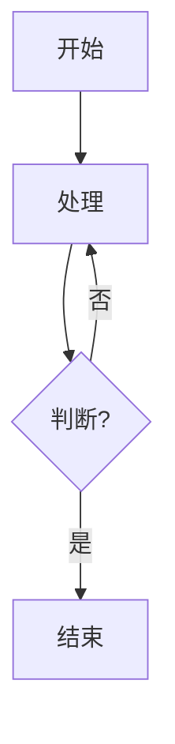

# Aurora 的个人博客

一个轻量、易部署且可定制的个人博客项目。包含前台展示、Markdown 增强渲染、后台管理（文章/图片/留言）与图片上传。

- 在线预览（示例）：[博客首页](https://bilibilidaxue.xyz/index.html)

## 功能特性

- **文章系统**：
  - 首页最新文章卡片与封面展示（支持显式封面与正文首图回退）
  - 博客列表页 `web/blog.html`（含分页、封面、分类/标签、摘要）
  - 文章详情 `web/article.html`（支持目录、图片预览）
- **Markdown 增强渲染**：
  - 使用 marked.js + highlight.js 进行渲染与代码高亮
  - 支持 KaTeX 数学公式（`$...$`、`$$...$$`）
  - 支持 Mermaid 图表（```mermaid 代码块）
- **后台管理（web/admin.html）**：
  - SimpleMDE 编辑器（自动保存、工具栏、实时预览）
  - 封面图片：支持本地上传、从图库选择、直接粘贴 URL
  - 编辑器内一键“从图库插入图片”
  - 图片管理：上传/列表/删除
  - 留言管理：筛选、审核
- **图片兼容处理**：内置对百度图片直链的使用指南；对过长 Data URL 与本地文件路径做安全回退

## 目录结构

```
├── server/                         # 云函数/服务器接口（基于 @lafjs/cloud）
│   ├── aritcle.ts                  # 文章接口：add/update/delete/list/get
│   ├── upload.ts                   # 图片上传与图库管理（云存储/内存存储降级）
│   ├── message.ts / message-admin.ts# 留言与后台审核接口
│   └── get-image.ts                # 内存图片读取（可按需）
├── web/                            # 前端静态站点
│   ├── index.html                  # 首页（最新文章+视频背景）
│   ├── blog.html                   # 博客文章列表页（封面+分页）
│   ├── article.html                # 文章详情页（Markdown 增强）
│   ├── admin.html                  # 管理后台（文章/图片/留言）
│   ├── about.html / message.html   # 其它页面
│   ├── baidu-image-guide.html      # 百度图片使用指南
│   ├── css/ js/ images/ videos/    # 静态资源
│   └── README.md                   # 子模块说明（如有）
├── package.json                    # 依赖（可选）
└── README.md                       # 本文件
```

## 前端技术栈

- 原生 HTML/CSS/JavaScript + Axios
- marked.js（Markdown 渲染）
- highlight.js（代码高亮）
- KaTeX（数学公式）
- Mermaid（流程/时序/甘特图等）
- SimpleMDE（编辑器）

## 后端与存储

- 接口基于 `@lafjs/cloud` 云函数风格实现（亦可移植至任意 Node 运行时）
- 图片上传默认尝试云存储，不可用时自动降级为内存存储（返回 Data URL，便于前端直接显示）
- 管理操作需管理员密码：
  - 在 `server/aritcle.ts` 与 `server/upload.ts` 中的 `ADMIN_PASSWORD` 修改默认密码

## 快速开始

1) 克隆代码

```bash
git clone https://github.com/122-syf-wcy/Blog.git
cd Blog
```

2) 前端直接预览

- 用浏览器打开 `web/index.html` 查看首页
- 管理后台打开 `web/admin.html`

3) 配置后端 API 地址（如你部署在自己的域名）

目前前端使用如下默认接口地址（可在相应页面顶部脚本中修改）：

```js
// web/index.html
const API_URL = 'https://rjjgamicpk.hzh.sealos.run/article';

// web/article.html
const API_URL = 'https://rjjgamicpk.hzh.sealos.run/article';

// web/admin.html
const API_URLS = {
  articles: 'https://rjjgamicpk.hzh.sealos.run/article',
  messages: 'https://rjjgamicpk.hzh.sealos.run/message-admin',
  images:   'https://rjjgamicpk.hzh.sealos.run/upload'
};
```

将以上地址替换为你的后端地址即可。

4) 登录后台

- 打开 `web/admin.html`
- 密码为服务端 `ADMIN_PASSWORD`，请在部署前修改。

## Markdown 支持速览

代码高亮：

```python
print('Hello, world!')
```

公式（KaTeX）：`$E=mc^2$` 或

```
$$\int_a^b f(x)\,dx$$
```

Mermaid：



## 部署建议

- 前端可直接部署到任意静态托管（如 GitHub Pages、Vercel、Netlify、Nginx 静态目录）
- 后端接口部署到你的云函数/Node 环境，并将前端 API 地址指向它

## 常见问题

- 大视频/大图片不要提交到仓库；可放置于 CDN/对象存储或服务端静态目录，并在前端引用
- 如果首页视频较大，可使用 `videos/background-compressed.mp4` 作为加载优先源
- 百度图片链接的复制方法与注意事项见页面：`web/baidu-image-guide.html`

## License

MIT

